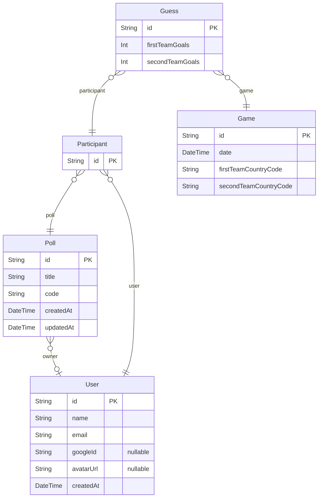

```mermaid
erDiagram

  Poll {
    String id PK 
    String title  
    String code  
    DateTime createdAt  
    DateTime updatedAt  
    }
  

  Participant {
    String id PK 
    }
  

  User {
    String id PK 
    String name  
    String email  
    String googleId  "nullable"
    String avatarUrl  "nullable"
    DateTime createdAt  
    }
  

  Guess {
    String id PK 
    Int firstTeamGoals  
    Int secondTeamGoals  
    }
  

  Game {
    String id PK 
    DateTime date  
    String firstTeamCountryCode  
    String secondTeamCountryCode  
    }
  
    Poll o{--|o User : "owner"
    Participant o{--|| User : "user"
    Participant o{--|| Poll : "poll"
    Guess o{--|| Game : "game"
    Guess o{--|| Participant : "participant"
```
